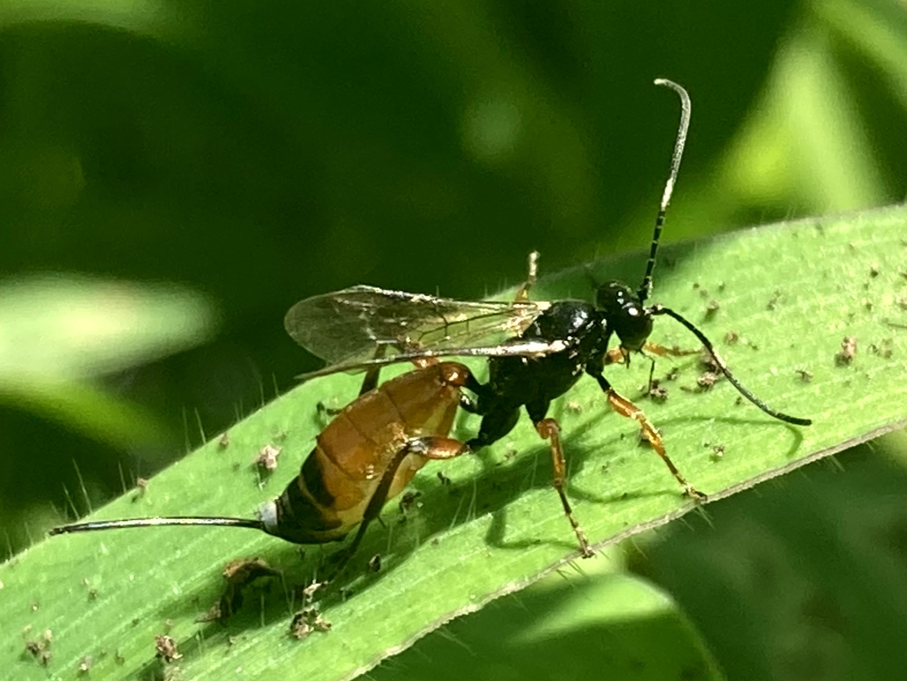

# Wasps

### Rusty Spider Wasp
*Tachypompilus ferrugineus*

This wasp has captured a large wolf spider and is in the process of hauling it up the side of a tree.

### Hairy Scoliid Wasp
*Scolia hirta*

## Ichneumon Wasps
Family Ichneumonidae

Ichneumonid wasps are an incredibly diverse group of parasitoids meaning they are parasites that eventually kill their hosts. Most lay eggs directly on or in their hosts where the larvae then develop by consuming the still living host. 

### Black Giant Ichneumonid Wasp
*Megarhyssa atrata*

These wasps parasitize woodwasp larve (specifically those of *Tremex columba*) by using their long ovipositor to burrow deep within decaying wood ["^"](https://link.springer.com/article/10.1007/s004350050082).

### Yellow Ichneumon Wasp
*Xanthopimpla punctata*

### Crown Wasp
Family Stephanidae

### Blue-winged Scoliid Wasp
*Scolia dubia*

The adults feed on flowers and dig in the ground in search of June beetle larvae to lay their eggs on.

### Great Golden Digger Wasp
*Sphex ichneumoneus*

### Banded Hornet
*Vespa tropica* or *Vespa affinis*

### Scoliid Wasp
family Scoliidae

### Paper Wasp
*Polistes species*

## Velvet Ants
Family Mutillidae

Velvet ants are actually a group of wasps. The wingless females search for the burrows of ground nesting bees where they lay their eggs. These insects have notably strong exoskeletons and painful stings.

*Dasymutilla species*

### Sacken's Velvet Ant
*Dasymutilla sackenii*

