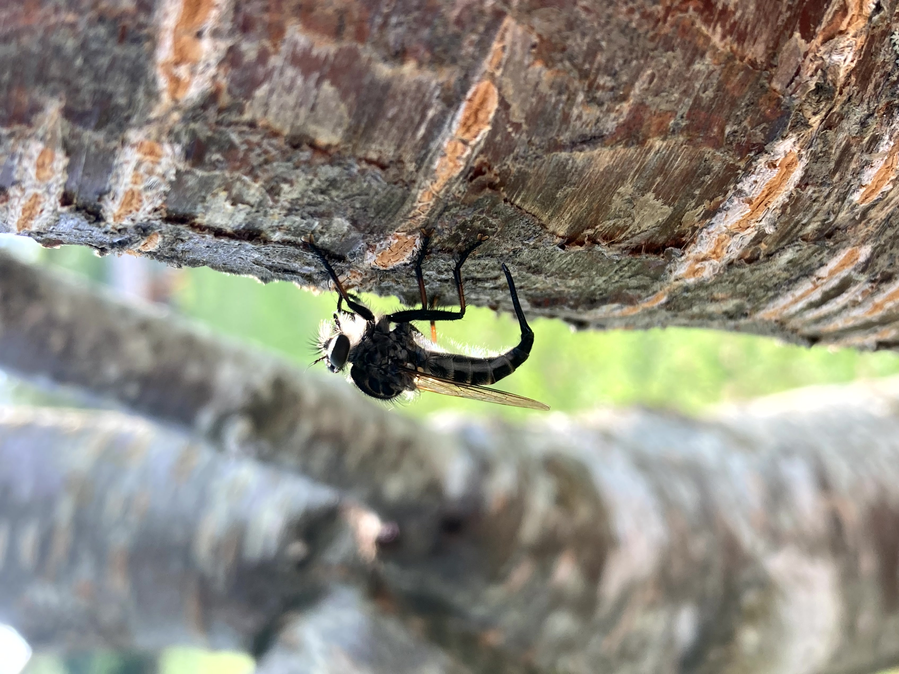
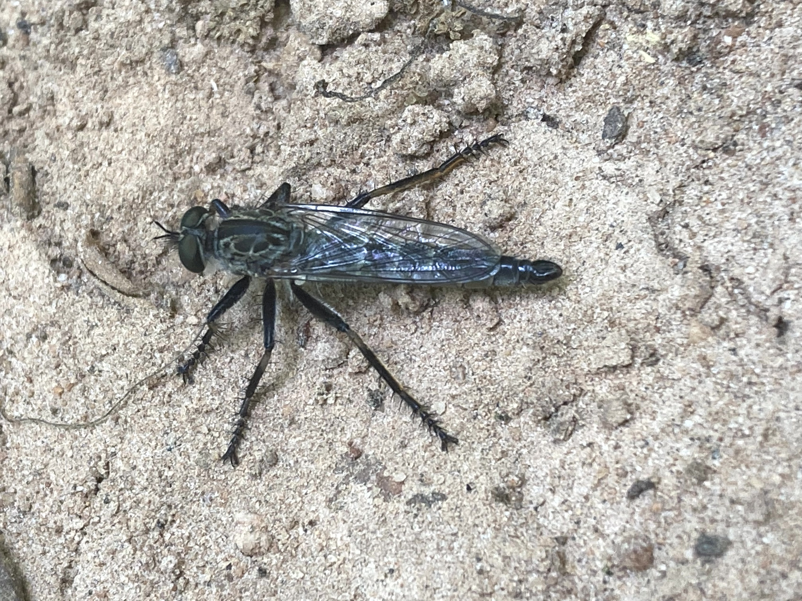

# Flies

### Clubbed Mydas Fly
*Mydas clavatus*

This fly mimics the appearance and behavior of spider wasps with quick movements. The larvae feed on beetle larvae.

## Robber Flies

Family: Asilidae

Robber flies are exceptional predators that specialize in capturing prey mid-flight.

### Plumetop
*Ommatius species*

### Red-footed Cannibal Fly
*Promachus rufipes*

Robber fly feeding on a wasp after catching it mid-flight.

### Plain-tailed Hanging Thief
*Diogmites neoternatus*

They tend to hang by their front legs while consuming prey.

### Spectacled Crane Fly
*Epiphragma solatrix*

It appears this individual has been infected with a fungus that has presumably emerged to release spores causing the white fuzzy appearence.

### Bumble Bee Mimic
Family Syrphidae

### Hover Fly
Family Syrphidae

### Golden-backed Snipe Fly
*Chrysopilus thoracicus*

Surprisingly little seems to be known about these flies. Other snipe flies are known to be predatory, but this hasn't seem to have been proven with the golden-backed snipe fly which is sometimes seen visiting flowers. I have only ever encountered them near wetlands or small creeks.

### Phantom Crane Fly
*Bittacomorpha clavipes*

### *Tipula furca*

### Yellow-faced Micropanther
*Cerotainia macrocera*

This tiny robber fly, only a few mm long, sits on the tips of leaves/twigs waiting for passing prey. 

### *Laphria species*

### Green Horse Fly
*Chlorotabanus crepuscularis*

### Fruit fly
*Drosophila species*

### Midge
Potentially from the genus *Chironomus*.

### Giant Crane Fly
*Tipula abdominalis*

### *Delphinia picta*

### March Fly
*Dilophus spinipes*

