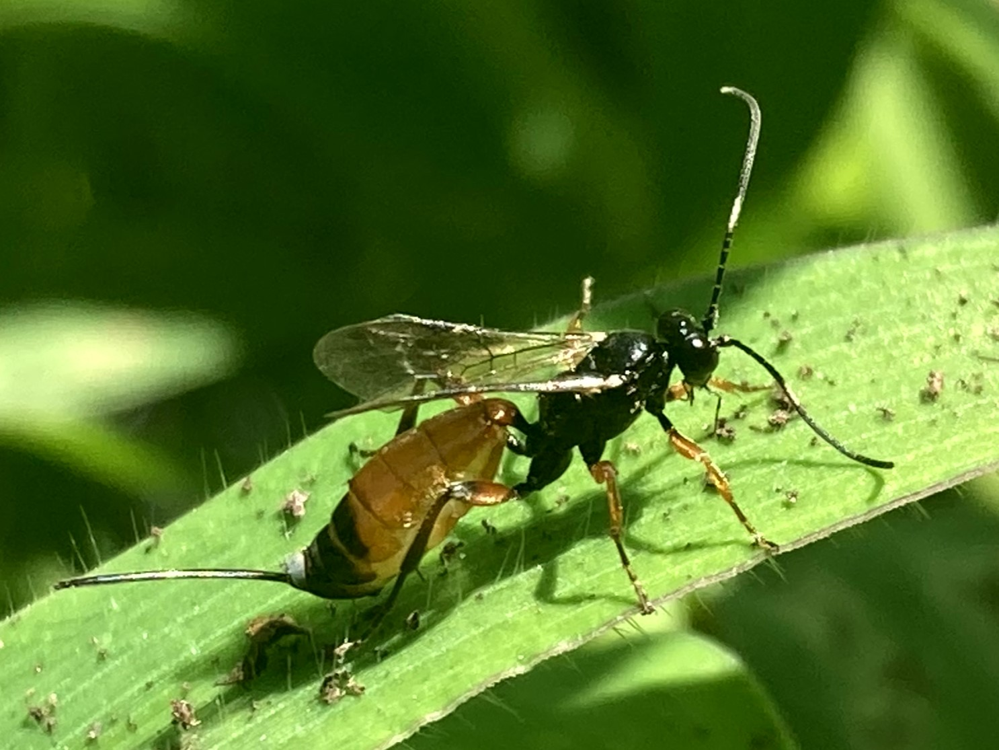
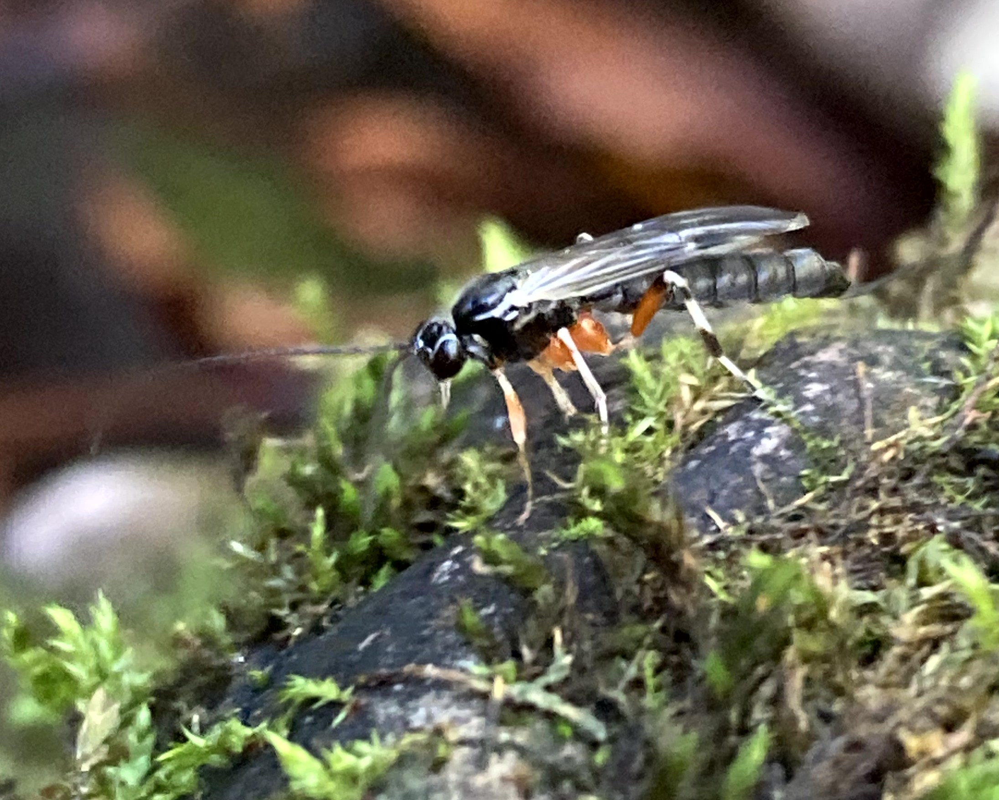

# Bees, Wasps & Ants

### Rusty Spider Wasp
*Tachypompilus ferrugineus*

This wasp has captured a large wolf spider and is in the process of hauling it up the side of a tree.

### Hairy Scoliid Wasp
*Scolia hirta*

## Ichneumon Wasps
Family Ichneumonidae

Ichneumonid wasps are an incredibly diverse group of parasitoids meaning they are parasites that eventually kill their hosts. Most lay eggs directly on or in their hosts where the larvae then develop by consuming the still living host. 

### Black Giant Ichneumonid Wasp
*Megarhyssa atrata*

These wasps parasitize woodwasp larve (specifically those of *Tremex columba*) by using their long ovipositor to burrow deep within decaying wood ["^"](https://link.springer.com/article/10.1007/s004350050082).

### Woolcarder Bee
*Anthidium manicatum*

### Dogwood Sawfly
*Macremphytus species*

Larvae resemble the caterpillar of a butterfly or moth.

