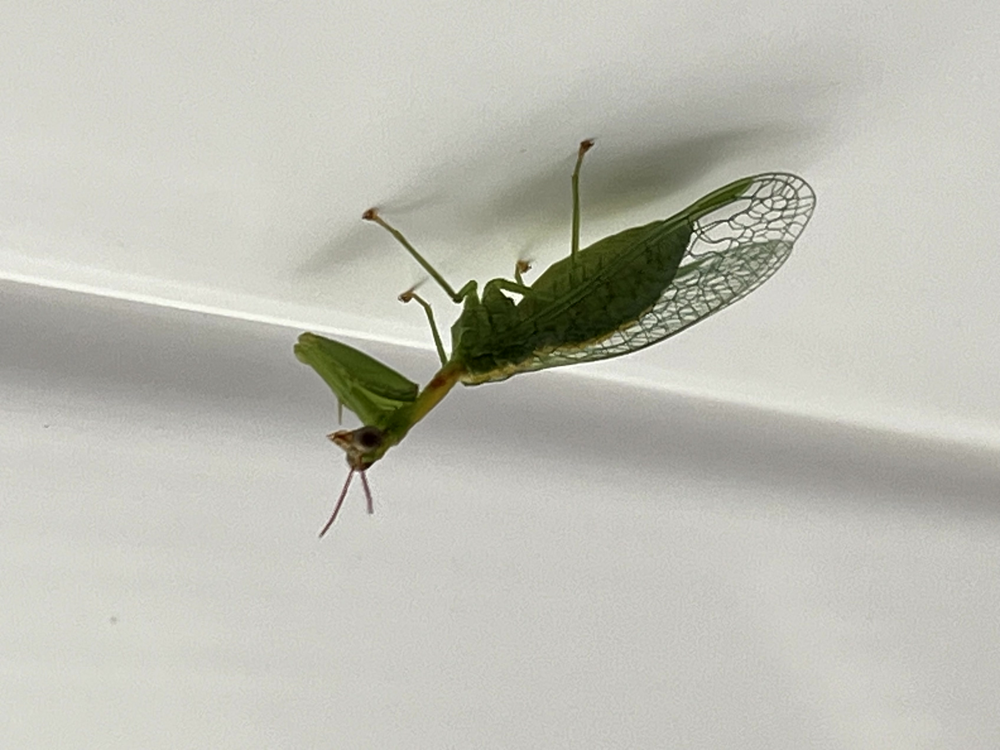

# Antilions, Lacewings & Mantidflies

### Green Mantidfly
*Zeugomantispa minuta*

### Lichen-carrying Green Lacewing
*Leucochrysa pavida*

The larval form of this insect covers itself with tiny bits of lichen as a form of camouflage.

