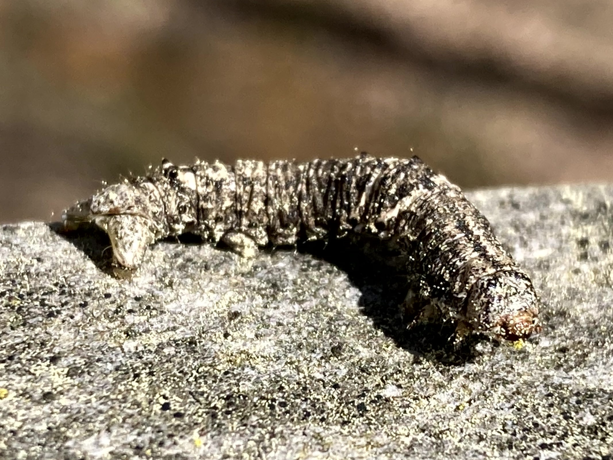

# Moths

Lepidopterans that are not butterflies are known as moths. This makes moths a paraphyletic group, a group that contains only some of a common ancestor's descendants.

## Saturniid Moths

Family Saturniidae



## Erebidae

The family Erebidae includes several recognizable moth groups such as the underwings; litter moths; tiger, lichen, footman and wasp moths; tussock moths; and more.



## Sphinx Moths

Family Sphingidae



## Slug Moths

Family Limacodidae



## Tropical Ermine Moths

Family Attevidae



## Noctuid Moths

Family Noctuidae



## Grass Moths

Family Crambidae



## Prominents

Family Notodontidae



## Geometer Moths

Family Geometridae



## Lappet Moths

Family Lasiocampidae




### Imperial Moth Caterpillar
*Eacles imperialis*

### Luna Moth

Seen here resting on a tree trunk in the woods near a small lake.

<!--  -->

### Waved Sphinx
*Ceratomia undulosa*

### Salt Marsh Moth
*Estigmene acrea*

### Walnut Sphinx
*Amorpha juglandis*

### Spiny Oak-slug Moth
*Euclea delphinii*

### Tulip-tree Silkmoth
*Callosamia angulifera*

### Ruby Tiger Moth
*Phragmatobia fuliginosa*

### Milkweed Tussock Moth
*Euchaetes egle*

### Carpenterworm Moth
*???*

### Blinded Sphinx
*Paonias excaecata*

### Crowned Slug Moth
*Isa textula*

### Polyphemus Moth
*Antheraea polyphemus*

### Ailanthus Webworm Moth
*Atteva aurea*

### Cecropia Moth
*Hyalophora cecropia*

### Eight-spotted Forester Moth
*Alypia octomaculata*

### Saddleback Caterpillar
*Acharia stimulea*

### Snowberry Clearwing
*Hemaris diffinis*

a.k.a. hummingbird moth or flying lobster

### Witch Hazel Dagger
*Acronict hamamelis*

### Banded Tussock Moth
*Halysidota tessellaris*

### Ilia Underwing
*Catocala ilia*

### Definite Tussock Moth
*Orgyia definita*

### Harnessed Tiger Moth
*Apantesis phalerata*

### Chickweed Geometer Moth
*Haematopis grataria*

### Rustic Sphinx
*Manduca rustica*

### White-marked Tussock Moth
*Orgyia leucostigma*

### Red-washed Prominent
*Oedemasia semirufescens*

### Skiff Moth
*Prolimacodes badia*

### Buck Moth
*Hemileuca maia*

### Orange-humbed Mapleworm Moth
*Symmerista species*

### Small-eyed Sphinx
*Paonias myops*

### Unknown
*???*

### Handmaiden Moth
*Syntomoides imaon*

### Geometer Moth
Family Geometridae

### Grass Moth
Family Crambidae

### Clouded Tiger Moth
*Creatonotos transiens*

### *Arctornis species*

### Footman Moths
*Ammatho cuneonotatus*

*Barsine defecta*



